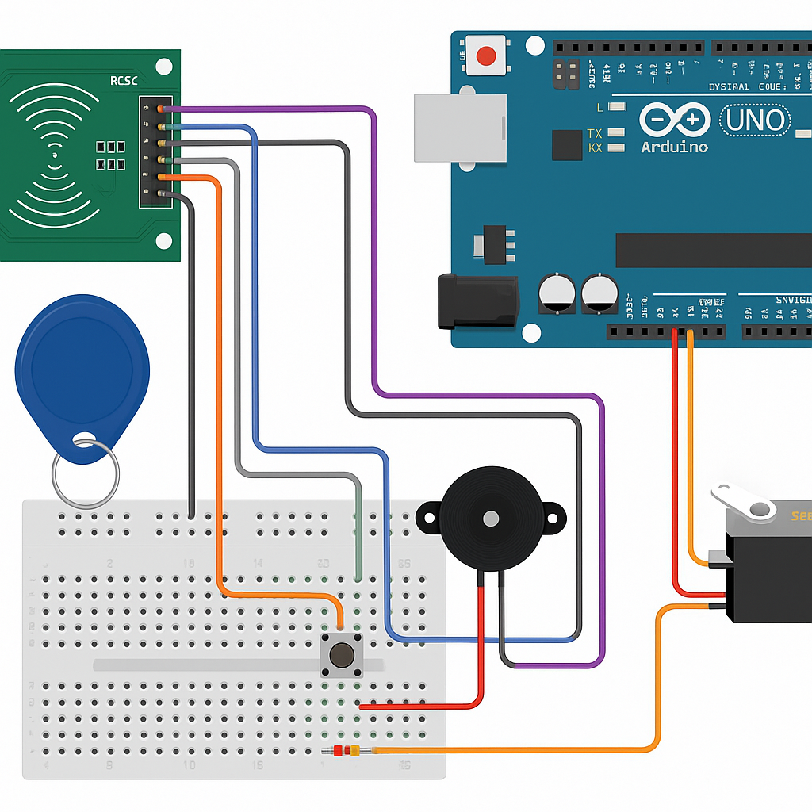

# RFID Door Locking System 🔐

This project is an RFID-based door locking system using the MFRC522 RFID reader, Arduino UNO, and a servo motor. Only authorized RFID cards/tags can unlock the door.

## 🧰 Components Used

- Arduino UNO
- MFRC522 RFID Module
- Servo Motor (SG90)
- Buzzer (optional)
- 10kΩ Resistor
- Breadboard & Jumper Wires
- 13.56 MHz RFID Tags/Cards
- Power Supply

## 🔌 Wiring Diagram

| MFRC522 | Arduino UNO |
|---------|-------------|
| SDA     | D10         |
| SCK     | D13         |
| MOSI    | D11         |
| MISO    | D12         |
| GND     | GND         |
| RST     | D9          |
| 3.3V    | 3.3V        |

## 💾 Code

The full Arduino code is available in the [`code/rfid_door_lock.ino`](code/rfid_door_lock.ino) file.

## 🛠️ How it Works

1. RFID card is scanned.
2. If UID matches authorized UID, the servo rotates to unlock position.
3. After a delay, it locks again.
4. Unauthorized UID triggers the buzzer (optional).

## ✅ Add Your UID

To find your card UID, upload the code and open the Serial Monitor. Replace `authorizedUID` with your tag's UID in the code.

## 📄 License

MIT License
